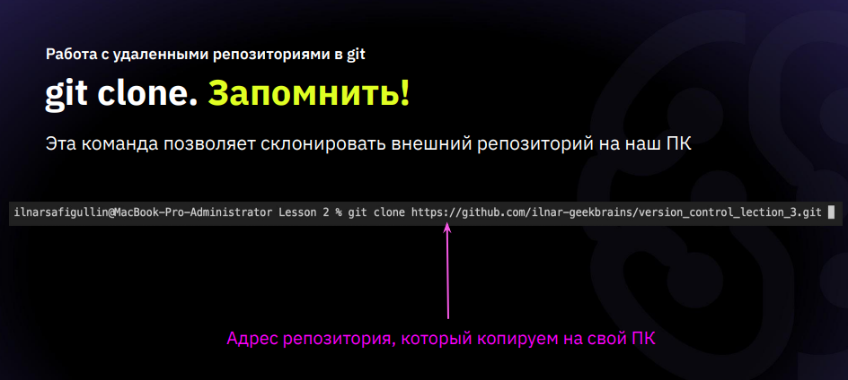
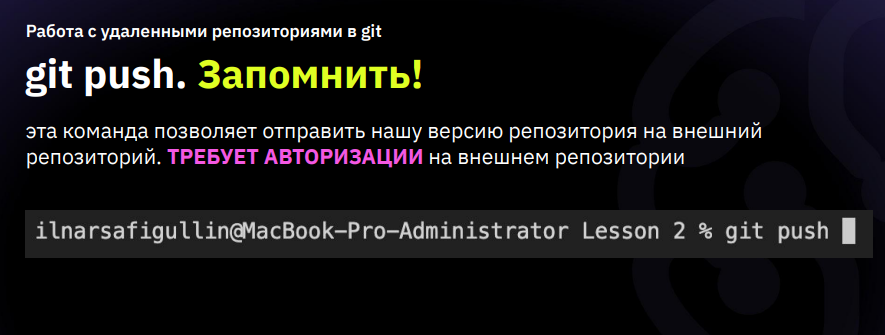
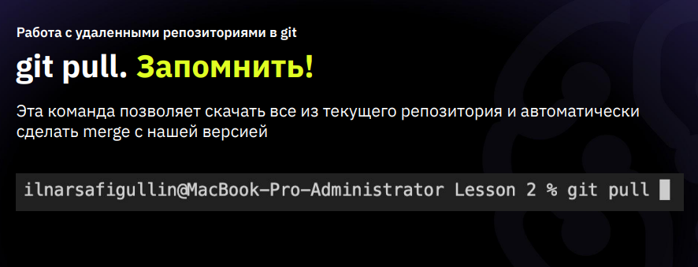
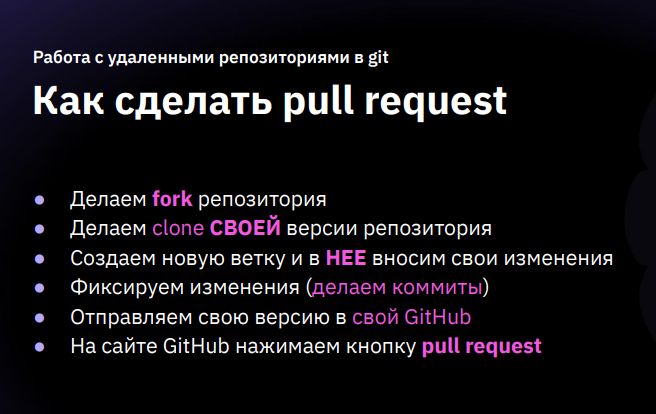

Инструкция для работы с Git и удалёнными репозиториями
=

Что такое Git?
-
Git - это одна из реализаций распределённых систем контроля версий, имеющая как и локальные, так и удалённые репозитории. Является самой популярной реализацией систем контроля версий в мире.

## Начало работы в Git

### Версия Git
Чтобы узнать какую версию git вы используете введите в терминале команду: *git —version*.

### Настройки Git
Чтобы узнать настройки вашего git введите в терминале команду: *git config --list*.

### Информация о пользователе
Чтобы сохранить имя пользователя введите команду *git config --global user.name <ваше имя>*.
Чтобы сохранить почту пользователя, введите команду: *git config --global user.email <ваша почта>".

Теперь Git знаком с вами.

## Подготовка репозитория

Для создания репозитория необходимо выполнить команду *git init* в папке с репозиторием.
У вас создасться репозиторий (появится скрытая папка .git).

## Создание сохранений (коммитов)

### Git add
Прежде чем добавить сохранение в Git, сохраните изменения файла на компьютере, нажав горячие клавиши *Ctrl + S*.

После этого для добавления измений в коммит используется команда *git add*. Чтобы использовать команду *git add* напишите *git add <имя файла>*.

Чтобы добавить все файлы к комиту используйте команду *<git add .>*.

### Создание коммитов
Для того, чтобы создать коммит(сохранение) необходимо выполнить команду *git commit*. Выполняется она так: *git commit -m "<сообщение к коммиту>*.

> Все файлы для коммита должны быть ***ДОБАВЛЕНЫ*** и сообщение к коммиту писать ***ОБЯЗАТЕЛЬНО***.

## Отслеживание изменений
Чтобы отслеживать состояние репозитория и сохранение изменений используйте команду *git status*.

Чтобы показать разницу между сохраненным файлом и последним коммитом используйте команду *git diff*.

## Сброс к сохранению (коммиту)
Чтобы произвести сброс (откат) к сохранению используйте команду 
Откат к фиксации (остальные удаляются): *git reset <номер коммита>*.

***БУДЬТЕ ОСТОРОЖНЫ!*** Более новые сохранения при этом ***УДАЛЯЮТСЯ***.

## Перемещение между сохранениями
Для того, чтобы перемещаться между коммитами, используется команда *git checkout*. Используется она в папке с пепозиторием следующим образом: *git checkout <номер коммита>*.

Чтобы перейти к актуальному сохранению (версии), введите команду *git checkout master*.

## Журнал изменений
Для того, чтобы посмтреть все сделанные изменения в репозитории, используется команда *git log*. Для этого достаточно выполнить команду *git log* в папке с репозиторием.

Чтобы открыть журнал изменений в упрощенном виде - введите команду *git log — oneline*.

> ### Дополнительные материалы:
>> 1. ***Шпаргалка*** - [основные команды git](https://gbcdn.mrgcdn.ru/uploads/asset/4047862/attachment/9442a8b70c63a6944b6c28858cfa8c37.jpeg)
>> 1. ***Видеолекция*** - [введение в git](https://www.youtube.com/watch?v=y18UF-qXMoE)

## Ветки в Git

### Доступные ветки

Чтобы посмотреть список доступных веток, используйте команду *git branch*.

### Создание ветки

Для того, чтобы создать ветку, используется команда *git branch*. Делается это следующим образом в папке с репозиторием: *git branch <название новой ветки>*.

### Переходы по веткам

Чтобы перейти с одной ветки на другую используйте команду _**git checkout** branch_name_

### Посмотреть журнал с отображением веток в виде дерева

Чтобы посмотреть журнал с отображением веток в виде дерева используйте команду _git log -- graph_.

## Слияние веток

Для того чтобы дабавить ветку в текущую ветку используется команда *git merge <name branch>*.

## Удаление веток
Для удаления ветки ввести команду *git branch -d 'name branch'*.

> ### Дополнительные материалы:
>> 1. ***Видеолекция*** - [работа с ветками в git](https://www.youtube.com/watch?v=6n5HgaTCVqU)

## Удаленные репозитории в Git

### Создание копии на локальном диске

Чтобы создать копию удаленного репозитория на локальном диске введите следующую команду: _**git clone** <ССЫЛКА на репозиторий с cайта github>_.

Чтобы начать работу с git перейдите в соответствующую созданную (скопированную) папку.

### Настройка доступа к удаленнному репозиторию

Если был создан новый пустой репозиторий, для импортирования данных в него предварительно необходимо настроить доступ - ввести серию команд:
1. Настройка удаленного доступа к репозиторию с добавлением его названия _**git remote add** `НАЗВАНИЕ ПОДКЛЮЧЕНИЯ` `ССЫЛКА`_.
1. Указание ветки: _**git branch -M** <НАЗВАНИЕ ГЛАВНОЙ ВЕТКИ>_
1. Пересылка данных в репозиторий: _**git push -u** <НАЗВАНИЕ ПОДКЛЮЧЕНИЯ> <НАЗВАНИЕ ВЕТКИ>_

### Добавление изменений в репозиторий

Чтобы добавить измеения в репозиторий необходимо ввести команду: **git push**.

Если была создана новая ветка необходимо ввести команду: _**git push -u** <НАЗВАНИЕ ВЕТКИ> (каждую новую созданную ветку тоже нужно называть)_.

### Синхронизация с удаленным репозиторием

Чтобы синхронизbроваться и подтянуть изменения c удаленного репозитория на локальный можно использовать команду **git pull**

### Pull request

Для предложения изменений в чужой репозиторию нкжно выполнить действия, описанные ниже.

> ### Дополнительные материалы:
>> 1. ***Видеолекция*** - [работа с удаленными репозиториями](https://www.youtube.com/watch?v=j6pzWVxgtXQ&t)